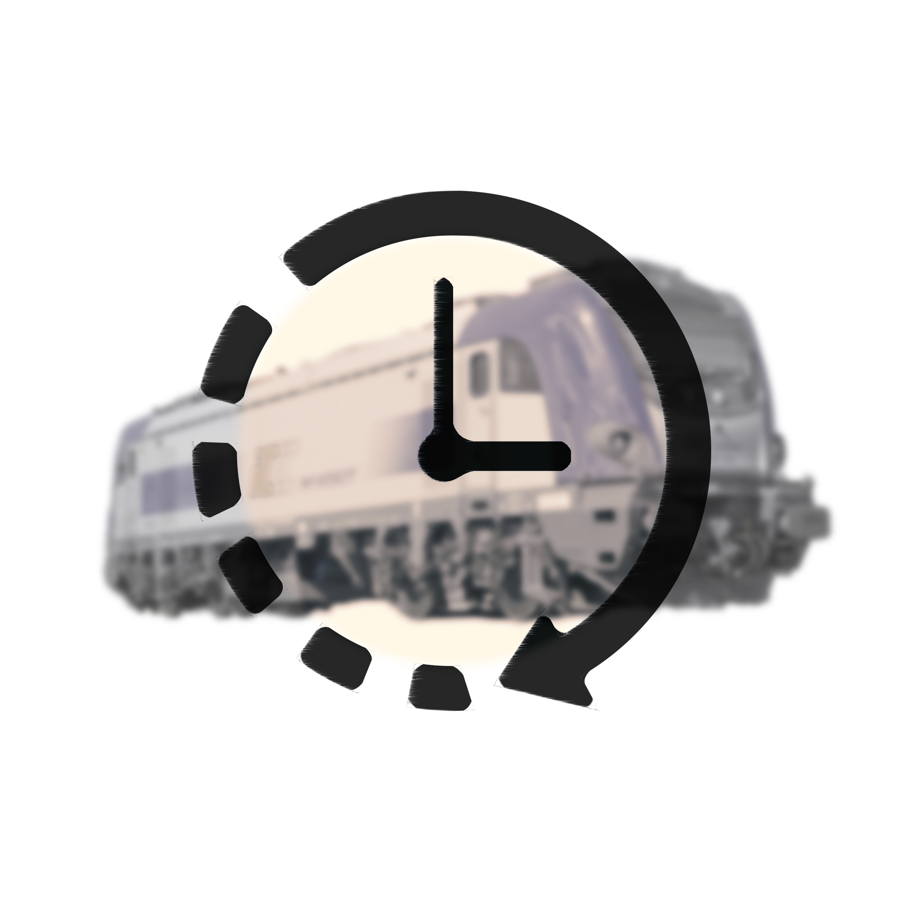
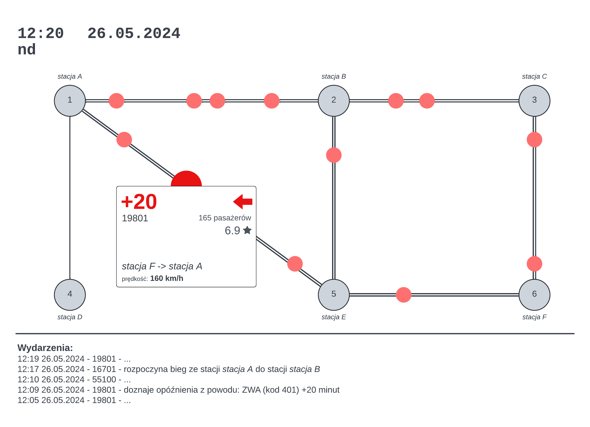
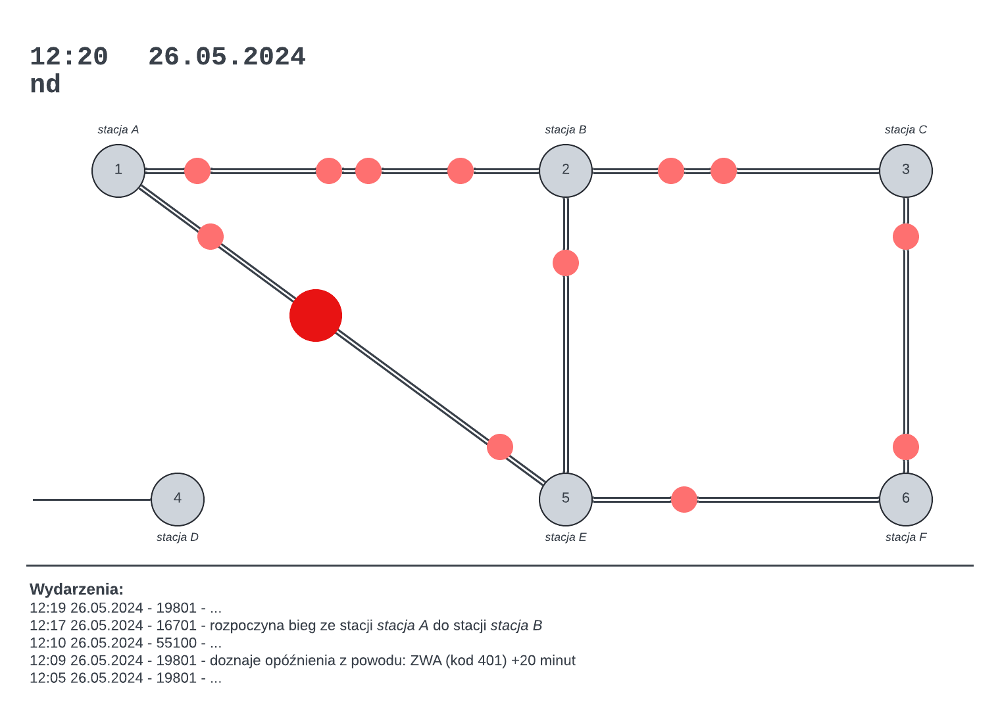

## delay-distribution-simulation

<table>
<colgroup>
<col style="width: 30%" />
<col style="width: 69%" />
</colgroup>
<thead>
<tr class="header">
<th><strong>PROJEKT</strong></th>
<th><strong>symulacja siatki opóźnień pociągów 
w grafie spójnym stacji docelowych</strong></th>
</tr>
</thead>
<tbody>
</tbody>
</table>

Krzysztof Wiłnicki ­­– opracowanie dokumentacji  
Kacper Wilgus – pomoc w opracowaniu dokumentacji*

**DDS – delay distribution simulation**

# PROBLEMATYKA
Przedstawienie wyników założeń projektowych dla węzłów przepustowości linii kolejowych. Pokazanie wpływu wypadków losowych na całkowity czas przejazdu dla różnych wariantów.

# INICJACJA

## **Założenie projektu.**

Założeniem projektu jest przedstawienie skutków niedokładnego (względnie
losowego) planowania ruchu pociągów, a także pokazanie złożoności
opóźnień wynikających z wypadków losowychi ich wpływu na całą sieć połączeń.

Symulacja zakłada bardzo uproszczony model siatki połączeń składający
się ze stacji początkowych i końcowych, linii jedno- i dwutorowych o różnych parametrach oraz 
składów pociągów o różnych parametrach.

## **Opóźnienie.**

Kluczowym parametrem wpływającym na płynność przeprowadzania symulacji i
różnicę między wynikami rzeczywistymi a oczekiwanymi będą rodzaje
opóźnień, wszystkie 10 z nich zostało przybliżone poniżej. Opóźnienia
stają się tym samym głównym agentem opisywanej symulacji.

### Opóźnienia losowe awaryjne.
####  *Awaria części składu.*
**AL** - awaria lokomotywy

*uszkodzenie hamulca pomocniczego, uszkodzenie silników tyrystorowych,
uszkodzenie pantografu etc.*

**AWP ** - awaria wagonu poważna

*uszkodzenie przewodu pneumatycznego, uszkodzenie sprzęgu
podstawowego, uszkodzenie wózka etc.*

**AWS ** - awaria wagonu symboliczna

*uszkodzenie węzła AC, uszkodzenie szafy automatyki etc.*

#### *Awaria urządzeń w trasie.*
**ASRK** - awaria urządzeń sterowania ruchem kolejowym

**ASEM**  - awaria semafora dowolnego typu

*jazda na sygnał zastępczy bądź z pominięciem syngału S1 „Stój”*

 

### Opóźnienia losowe wypadkowe.
**WCZ**
wypadek z udziałem człowieka / zwierzęcia

**WPO**
wypadek z udziałem pojazdu

**ZWA**
złe warunki atmosferyczne

**PRZ**
przyczyny związane z działalnością przewoźnika kolejowego

**ZIN**
przyczyny związane z działalnością zarządcy infrastruktury

 

### Omówienie zależności.
Każde z opóźnień posiada swoją charakterystykę uproszczoną do 4
podstawowych składowych:

wypadkowej czasu
    
>*wskaźnik WYP – WYPADKOWA dla pojazdu dotkniętego  
    oraz innych (zależność opisana w przykładzie nr 2 poniżej)*

prawdopodobieństwa wystąpienia 
> *wskaźnik PROB*

spadku priorytetu trasowego
> *wskaźnik SPT*

i dodatkowych uwag.

> UWAGA! W czasie symulacji odwoływanie pociągów przewiduje się
> **wyłącznie** w sytuacji przekroczenia całkowitej ilości opóźnienia
> dla danego pociągu **powyżej 500** **minut**, **niezależnie od
> długości planowej trasy** – każdy inny skład wykonuje pracę przewozową
> na bazie swoich dwóch stacji krańcowych: początkowej i końcowej bez
> możliwości ich zmiany.
>
> ***Przykład nr 1**:*
>
>> *Awaria lokomotywy jest jedną z poważniejszych przyczyn, taka sytuacja
> wymaga bowiem zastąpienia lokomotywy pierwotnej, przy tym zapewnienia
> nowej drużyny trakcyjnej. Optymalne rozwiązanie nakłada tym samym na
> skład względnie duże opóźnienie. Dodatkowo pociąg taki blokuje przez
> pewien czas szlak główny, generując opóźnienie innych składów.*
>
>
>
> Wszystkie opóźnienia ze względu na mechanikę działania będą
> rejestrowane w danych wynikowych.

### (!) Informacje do karty charakterystyki zależności czasowych

Przedstawia ona wpływ danego opóźnienia na pojazd dotknięty opóźnieniem, jak i pojazdy znajdujące się na tym samym szlaku za pojazdem dotkniętym w kierunku
poruszania się tego pojazdu.

Przykładowe obliczenie wypadkowej czasu danego opóźnienia zostało
przedstawione poniżej:

> ***Przykład nr 2**:*
>
> *Pociąg ABxxxxx uległ **awarii lokomotywy** z **prawdopodobieństwem**
> równym **0.08**. Podstawowy całkowity czas przejazdu ze stacji A do
> stacji B wyniósł*
>
> **T****C** = **120** **min** *.*
>
> *Opóźnienie wydłuży czas przejazdu o wypadkową*
>
> **WYP** = **1/2** * **T**C**** = **60** **min** *.*
>
> ***Symulacja zatrzymuje** przejazd* pociągu *do momentu odliczenia
> **równowartości WYP**. Stąd wynika, że całkowity czas przejazdu pociągu dotkniętego opóźnieniem wyniesie
> końcowo*
>
> **T****C** + **WYP** = 120 + 60 = **180** **min** *.*
> *Zgodnie z tabelą charakterystyki, kolejne trzy* pociągi *w tej samej
> relacji* **oznaczone kolejnością** **k** **1** **−** **3** *(jeśli
> takowe występują) także zostaną opóźnione – **symulacja NIE
> zatrzymuje** ich przejazdu w kierunku stacji docelowej – opóźnienie to
> wyniesie*
>
> **WYP**1-3 = [1/7 * **WYPPD**] = **9 min .**
>
> *Stąd wynika, że całkowity czas przejazdu trzech kolejnych pociągów (k
> 1-3) w tej samej relacji dotkniętego opóźnieniem wyniesie końcowo*
> 
>**T****C** + **WYP**1−3**** = *X* + 9 [min] , 
>
>*gdzie X − T*C* pociągów k 1 − 3*.
> 
> *Dla tego typu awarii obliczyć należy kolejne (ostatnie) opóźnienia –
> tym razem dla kolejnych trzech pociągów w tej samej relacji, lecz
> **oznaczonych kolejnością k 4−6**
> (jeśli takowe występują). Tak samo jak powyżej, **symulacja NIE zatrzymuje** ich
> przejazdu w kierunku stacji docelowej, a opóźnienie wyniesie*
>
> **WYP**4-6 = [1/14 * **WYPPD**] = **5 min .**
>
> *Stąd wynika, że całkowity czas przejazdu trzech kolejnych pociągów (k
> 1-3) w tej samej relacji dotkniętego opóźnieniem wyniesie końcowo*
>
>**T****C** + **WYP**4−6**** = *X* + 9 [min] ,
> 
>*gdzie X − T*C* pociągów k 4 − 6*.

Skrótowe oznaczenia dla powyższego przykładu zostały sklasyfikowane poniżej:  
*T**C* [min]&nbsp;&nbsp; - &nbsp;&nbsp;czas całkowity przejazdu pociągu \[w minutach\] \[parametr pociągu\]  
*WYP*&nbsp;&nbsp; - &nbsp;&nbsp;wypadkowa czasu opóźnienia  
*PD* &nbsp;&nbsp;-&nbsp;&nbsp; pojazd dotknięty  
*WYPPD*&nbsp;&nbsp; - &nbsp;&nbsp;oznaczenie zastępcze dla wyrażenia «WYPADKOWA CZ. OPÓŹ. dla PD»  
*k* *n* − *m* &nbsp;&nbsp;-&nbsp;&nbsp; n, m numeruje kolejne *pociągi* za PD  
*min &nbsp;&nbsp;&nbsp; max* &nbsp;&nbsp;- &nbsp;&nbsp;minimalna i maksymalna wartość wskaźnika  
*mini* &nbsp;&nbsp;-&nbsp;&nbsp; minimalna wartość priorytetu

Wszystkie ułamki widoczne w tabeli zaokrąglane są w górę sufitowo (tak
jak wskazane w przykładzie nr 2) do najbliższej liczby całkowitej.

Karta dostępna jest w folderze *docs/karta*.

### Opóźnienie w kontekście *pociągu*.

Jako iż w kolejnym punkcie omówieniu ulega obiekt typu *pociąg,*
należy przedstawić wszystkie możliwe sposoby zobrazowania zebranego
opóźnienia przez wszystkie tego typu obiekty w toku trwania symulacji.

Opóźnienie w zamyśle obiektu typu *pociąg* dotyczy obliczania
dodatkowego czasu przejazdu względem początkowo ustalonego całkowitego
czasu przejazdu *T**C*. Na koniec symulacji opóźnienie dla
każdego *pociągu* przedstawiane jest na cztery sposoby:

-   liczbowa wartość opóźnienia w minutach (oraz jej stopień zaawansowania),
-   całkowity czas przejazdu po uwzględnieniu opóźnienia,
-   różnica względna wyrażana w procencie *T**C*,
-   odchylenie od średniego opóźnienia wszystkich pociągów na koniec symulacji.

## **Pociąg.**

Obiektami nominalizowalnymi przez opóźnienia-agentów, poruszającymi się
po wirtualnej mapie obiegów stacyjnych (z założenia początkowego) są
*pociągi*. Każdy z tego typu obiektów posiada następujący zestaw
parametrów wpływający na płynność jazdy, efektywność rozkładową oraz
ostateczną moc opóźnienia:

### Kierunek poruszania.

Każdy *pociąg* bezwzględnie potrzebuje parametru kierunku poruszania
ze względu na determinację opóźnień kolejnych jednostek powodowanych przez niego
samego. Jeżeli dwa pociągi znajdują się w na tej samej linii w tej samej trasie, będą
na siebie oddziaływać liniowo z każdym przeskokiem czasowym symulacji.
Kierunek określany jest na zasadzie rachunku kodów stacji – jeśli

|*W*1*A*−*W*1*B*| = |*W*2*A*−*W*2*B*|

*gdzie Wxy - kod stacji dla x pociągu i y stacji (gdzie A to najbliższa stacja poprzednia, a B to najbliższa stacja następna zgodnie z planowym biegiem pociągu)*

to znaczy, że pociągi poruszają się **w tej samej relacji** – na tym samym szlaku w tym samym kierunku.
>
> **WAŻNE! Graf wynikowy zostaje stworzony w taki sposób, aby żadna z relacji nie posiadała tej samej wartości identyfikacyjnej (aby działanie wartości bezwzględnej z różnicy dwóch kodów stacji zwracało taki sam wynik).**

### Przepustowość.

Każdy *pociąg* symbolizuje liczbowo ilość przystanków pośrednich (niewliczanych do danych symulacyjnych) oraz średni czas postoju na takowych. Dane te w pierwotnej wersji wprowadzane są losowo, a na ich podstawie wyliczana jest względna przepustowość końca szlaku (ilość kilometrów pozostająca za *pociągiem* na szlaku wg parametryzacji priorytetowej) wg poniższego wzoru:

Pmax = Vmax / (SP * TP)

*gdzie Vmax − prędkość maksymalna,  S*P* − ilość przystanków pośrednich,  T*P* − średni czas postoju*

Ilość kilometrów konwertowana jest następnie na wektor odległościowy za pojazdem wstrzymujący kolejny pojazd w kolei od najechania nań. Przepustowość ostatecznie nie wpływa na zmianę czasu opóźnienia obiektu poszkodowanego, a raczej obiektów nieposzkodowanych.

### Pasażerowie.

Każdy *pociąg* posiada 3 parametry opisujące jego nabytą frekwencję. Są to:

-   średnia ilość pasażerów – wyznaczana losowo dla każdego generowanego
    obiektu
-   maksymalna pojemność (wytyczona) – jako parametr domyślny ładunku
    pasażerskiego
-   frekwencja względna wyznaczana wg poniższego wzoru:

QF = PAS / (PAS*max*) * 100%

gdzie
PAS − średnia ilość pasażerów,
PASmax  − maksymalna pojemność pojazdu

### Oznaczenie.

Oznaczenie *pociągu* opierać się będzie na symbolicznym przyporządkowaniu go do kategorii stanowiącej charakterystykę
przewozową. Drugi człon odpowiada 5-cyfrowemu numerowi handlowemu.

**Oznaczenia te nie będą wykorzystywane w docelowej logice symulacyjnej, a jedynie pomogą w odróżnieniu konkretnych obiektów!**

### Aktualne opóźnienie.

Opóźnienie zdobyte w trakcie biegu *pociągu* będzie wyświetlane w czasie rzeczywistym symulacji w sposób wizualnie zrozumiały.

Prototyp
wizualizacji obrazującej ww. zasady symulacji wygląda następująco:

Na rysunku zauważamy także element charakterystyczny dla *pociągu* – okno dodatkowej informacji. Dedykowane dla każdego *pociągu*, generowane w czasie rzeczywistym.

### Dodatkowe informacje.

Dodatkowe informacje obejmują stację początkową biegu, stację końcową, aktualną prędkość akutalizowaną schematycznie z każdą sekundą symulacji.

## **Stacja.**

Pojęcie grafu spójnego *stacji* docelowych oznacza jednoznacznie sieć, w której wierzchołkami są *stacje*, z żadnej z których nie wybiega półprosta do stacji niewidocznej na schemacie, a nieprawidłowym   jest także pozostawienie *stacji* bez jakiegokolwiek połączenia (wierzchołek izolowany). Poprawna sytuacja przedstawiona została na rysunku 1. w punkcie 2.4. Poniżej zobrazowana jest przykładowa niepoprawna sytuacja: niepoprawne:

Na chwilę obecną przewiduje się wprowadzenie pola nazwy stacji dla
poprawnego odróżniania kolejnych obiektów w toku trwania symulacji w kontekście użytkownika.

## **Szlak.**

Wszystkie linie kolejowe zaznaczone na wizualizacji symulacyjnej są zbudowane w ten sam sposób  z odróżnieniem linii jedno- i dwutorowych. Pierwsze zaznaczane są jedną linią odcinkową między kolejnymi stacjami – drugie kreślone zostają poprzez dwa równoległe odcinki międzystacyjne. Rozróżnienie widać to na rysunkach 1. do 3.

## **Uwagi dodatkowe.**

Opóźnienia rejestrowane są w oparciu o ilość ich wystąpień – zasada doliczania do względnej reprezentacji danych wygląda następująco:

do końcowego zestawienia danych zliczane są jedynie opóźnienia powyżej 5
minut wynikowych (dodanych do całkowitego planowego czasu przejazdu
pociągu). **Wynika to z oficjalnej klasyfikacji opóźnień – wg raportów
Urzędu Transportu Kolejowego, większość przewoźników nie wlicza do
swoich klasyfikacji obsunięć czasowych względem rozkładu jazdy
mniejszych od 5 minut.**  
Tym samym powyższa teoria symulacji również takie zachowanie uwzględnia.

# IMPLEMENTACJA

Wybranym językiem programowania (platformą wykonawczą) jest język **Java
(wersja stabilna jdk 19.0.1)** z wykorzystaniem biblioteki **JavaFX
(wersja stabilna 22.0.1)**. Narzędziem umożliwiającym automatyczne
budowanie oprogramowania i zarządzanie zależnościami w projekcie obrany
został **Gradle (wersja stabilna 8.2)**. Wykaz dodatkowych zależności,
importowanych bibliotek etc. znajduje się w dalszej części dokumentacji.

### postanowienia końcowe
MIT copyright © 2023